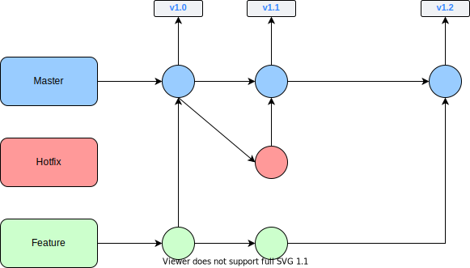
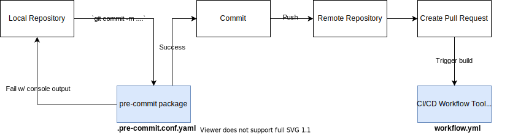
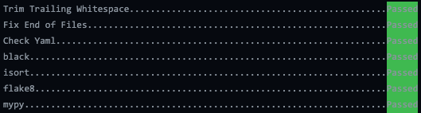

Project Standards
=================

Development Environment
-----------------------
If you haven't already, please visit :ref:`"(b) Development Environment" <dev-env>`
to set up your local development environment.

Version Control (VC)
--------------------

The repository uses a fork-based Git workflow with tag releases.

Guidelines for VC
~~~~~~~~~~~~~~~~~
1. ``main`` must always be **deployable**
2. All changes are made through **support** branches on forks
3. **Rebase** with ``main`` to avoid/resolve conflicts
4. Make sure ``pre-commit`` checks pass when committing (enforced in CI/CD build)
5. Open a pull-request (PR) early for discussion
6. Once the CI/CD build passes and PR is approved, the PR is ready to merge.  
7. Merge PR into ``main``. For small changes, use the "Squash and merge" option. For big changes with many distinct commits, or commits contributed by different developers, use the "Create a merge commit" option.
8. Delete the branch on GitHub and in your local workspace.

Things to Avoid in VC
~~~~~~~~~~~~~~~~~~~~~
1. Don't merge in broken or commented out code
2. Don't commit onto ``main`` directly
3. Don't merge with conflicts (handle conflicts by rebasing: ``git rebase upstream/main``)

Source: https://gist.github.com/jbenet/ee6c9ac48068889b0912

Pre-commit
~~~~~~~~~~
The repository uses the ``pre-commit`` package to manage pre-commit hooks.
These hooks help enforce quality assurance standards and identify simple issues
at the commit level before submitting code reviews.

   ``pre-commit`` Flow

Helpful ``pre-commit`` Commands
^^^^^^^^^^^^^^^^^^^^^^^^^^^^^^^

``zppy`` uses the following pre-commit checks:

* **trailing-whitespace** - Trims trailing whitespace from the end of each line.
* **end-of-file-fixer** - Ensures files end with a single newline character.
* **check-yaml** - Validates YAML files for correct syntax.
* **black** - Auto-formats Python code to a consistent style using the `black <https://black.readthedocs.io/en/stable/>`__ formatter.
* **isort** - Sorts and organizes Python import statements alphabetically and by type using `isort <https://pycqa.github.io/isort/>`__.
* **flake8** - Lints Python code for style violations and common errors (PEP 8) using `flake8 <https://github.com/PyCQA/flake8#flake8>`__.
* **mypy** - Runs static type checking on Python code using type annotations using `mypy <http://mypy-lang.org/>`__.

Install into your cloned repo ::

    conda activate zppy_dev
    pre-commit install

Automatically run all pre-commit hooks (just commit) ::

    # Tip: If there is an issue with pre-commit, you can bypass with the `--no-verify` flag. Please do NOT use this on a regular basis.
    git commit -m '...'

   ``pre-commit`` Output

Manually run all pre-commit hooks ::

    pre-commit run --all-files

Run individual hook ::

    # Available hook ids: trailing-whitespace, end-of-file-fixer, check-yaml, black, isort, flake8, mypy
    pre-commit run <hook_id>

.. _ci-cd:

Continuous Integration / Continuous Delivery (CI/CD)
----------------------------------------------------

This project uses `GitHub Actions <https://github.com/E3SM-Project/zppy/actions>`_ to run two CI/CD workflows. The workflows are defined `here <https://github.com/E3SM-Project/zppy/tree/main/.github/workflows>`__.

1. CI/CD Build Workflow

  This workflow is triggered by Git ``pull_request`` and ``push`` (merging PRs) events to the the main repo's ``main``.

  Jobs:

    1. Run ``pre-commit`` for formatting, linting, and type checking
    2. Run test suite in a conda environment
    3. Publish latest ``main`` docs (only on ``push``)

  When a pull request is made, the build workflow is run automatically on the pushed branch. When the pull request is merged, the build workflow is once again run, but this time on the ``main`` branch.

2. CI/CD Release Workflow

  This workflow is triggered by the Git ``publish`` event, which occurs when a new release is tagged.

  Jobs:

    1. Publish new release docs
    2. Publish Anaconda package

API Documentation
-----------------

In most cases, code should be self-documenting.

If necessary, documentation should explain **why** something is done, its purpose, and its goal.
The code shows **how** it is done, so commenting on this can be redundant.

Guidelines For Documenting
~~~~~~~~~~~~~~~~~~~~~~~~~~

-  Embrace documentation as an integral part of the overall
   development process
-  Treat documentation as code and follow principles such as *Don't
   Repeat Yourself* and *Easier to Change*
-  Use comments and docstrings to explain ambiguity, complexity,
   or to avoid confusion
-  Co-locate API documentation with related code
-  Use Python type annotations and type comments where helpful

Things to Avoid with Documenting
~~~~~~~~~~~~~~~~~~~~~~~~~~~~~~~~

-  Don't write comments as a crutch for poor code
-  Don't comment *every* function, data structure, type declaration
