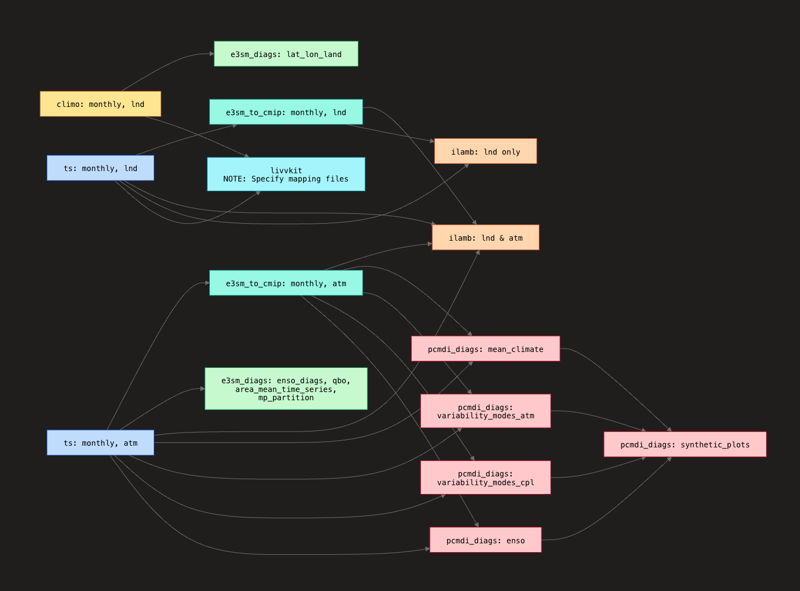
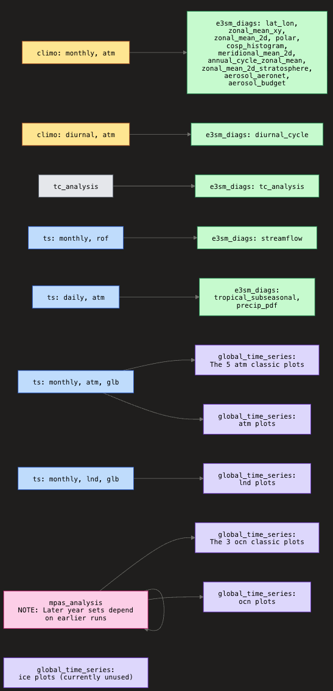

.. _dependency_graph:

************
Dependencies
************

Dependency graphs for ``zppy`` tasks and subtasks:

Graphs generated by Claude based on the Mermaid code below.

Main connected component:

.. literalinclude:: ../dependencies_main.mmd
   :language: mermaid
   :linenos:

Trivial dependencies:

.. literalinclude:: ../dependencies_trivial.mmd
   :language: mermaid
   :linenos: