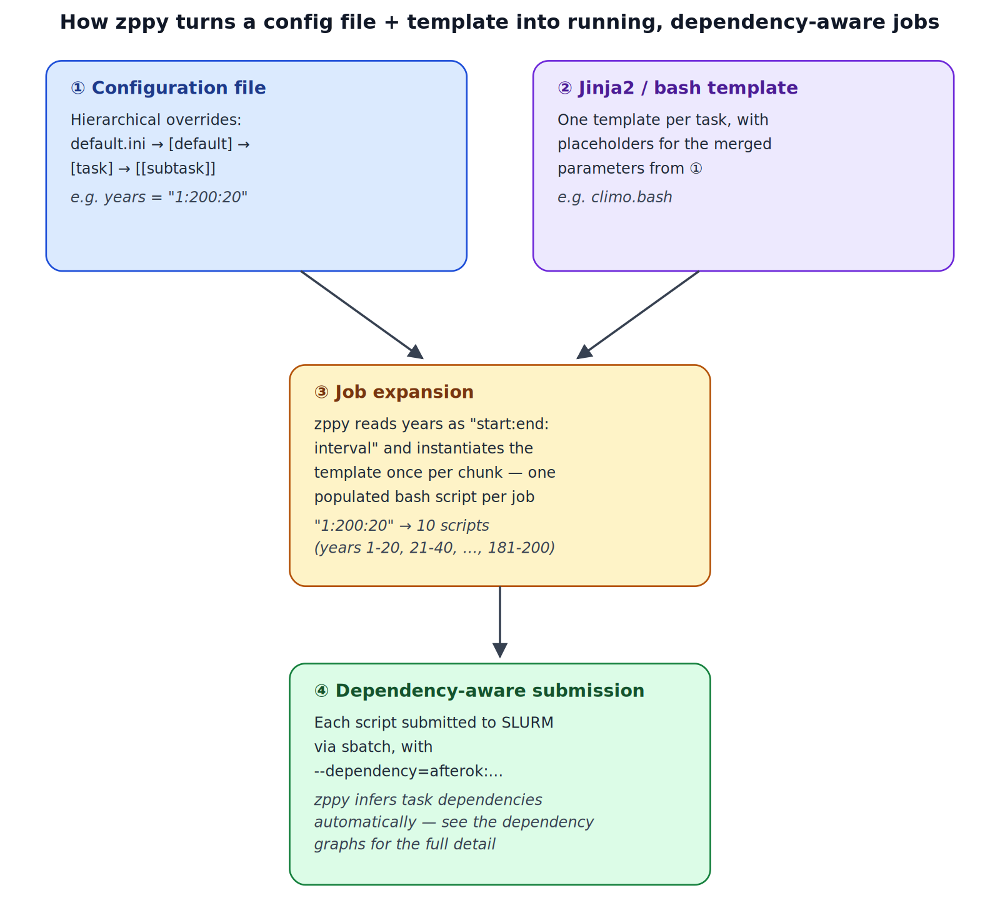

************************
A schematic view of zppy
************************

The above diagram (generated by Claude) shows the major components of the ``zppy`` workflow:

1. The config file. Users launch ``zppy`` with ``zppy -c config.cfg``. Parameters are set based on a hierarchy: ``default.ini``'s default parameter settings; the ``[default]`` section; the ``[[task]]`` section; the ``[[subtask]]`` section.
2. Jinja2 bash templates. Parameters from the ``cfg`` can be substituted in.
3. Insantiated bash scripts. By substituting the appropriate values from the ``cfg`` into the relevant bash template, ``zppy`` is able to create working bash scripts and then run them. For example, if a user wants to run 200 years of analysis in 20 year increments, they just need to specify ``1:200:20`` and ``zppy`` will know to launch 10 scripts to cover that time period.
4. Dependency awareness. ``zppy`` will know if a job can't yet be launched. For more on this, see :ref:`dependencies <dependency_graph>`.

If users re-run ``zppy`` only previously failed or newly requested jobs will be launched.
