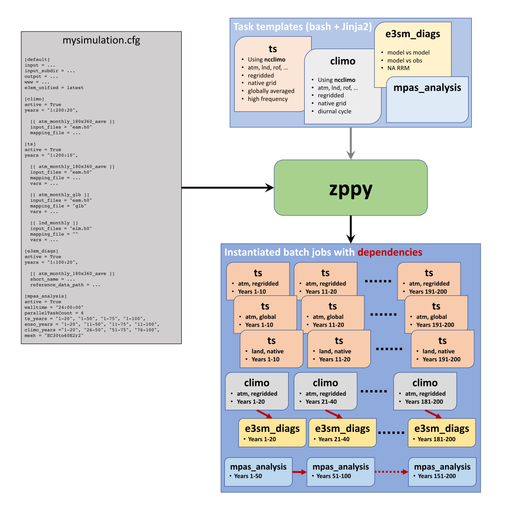

.. zppy documentation master file, created by
   sphinx-quickstart on Fri Feb 19 18:07:14 2021.
   You can adapt this file completely to your liking, but it should at least
   contain the root `toctree` directive.

.. _index-label:

******************
Zppy documentation
******************

What is zppy?
=============

Zppy (pronounced zippee) is a post-processing toolchain for E3SM written in 
Python. The goal of zppy is to speed-up the post-processing of E3SM simulations
by automating commonly performed tasks.

Zppy is built around a set of tasks that perform specific actions,
such as generating (regridded) **time series** or **climarology** files
using NCO's ncclimo, or generating analysis figures with **E3SM Diags** 
or **MPAS-Analysis**. Zppy provides a framework to simplify the use of these
tools, especially for long simulations.

The figure below illustrates schematically how zppy functions. 

Zppy is controlled entirely from a single user provided configuration file 
("mysimulation.cfg"). This configuration file specifies input and output 
directories, as well as the list of tasks to run. Each task operates 
for a specific model component and over 
a specified number of years, for example to generate atmosphere climatology 
files every 20 and 50 years.

Zppy parses the configuration file and generates batch
jobs that are submitted for execution by SLURM. Dependencies between tasks
are handled and passed to SLURM. Internally, each batch job is created by
instantiating `Jinja <https://jinja.palletsprojects.com>`_ template scripts 
usually written in bash, but other languages are supported as well.

.. toctree::
   :maxdepth: 2
   :caption: Contents:

   self
   getting_started
   contributing

